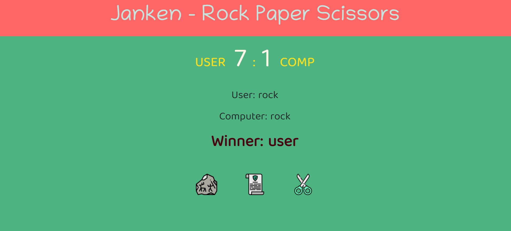

## What to build

we have to build ROCK PAPER SCISSOR Game.

## Input

## Techanology used

we have used HTML, CSS and JavaScript DOM

## What I have learned from this project

I have learned how to Design ROCK PAPER SCISSOR Game, In Game user Have to select one option from paper, rock and scissors and for computer I have Generated value using random function. I have Given 10 chance for both user and computer In 10 chance whom have Higher number of wins that will be winer.

## Output

### Instructor

**Hitesh choudhary**
